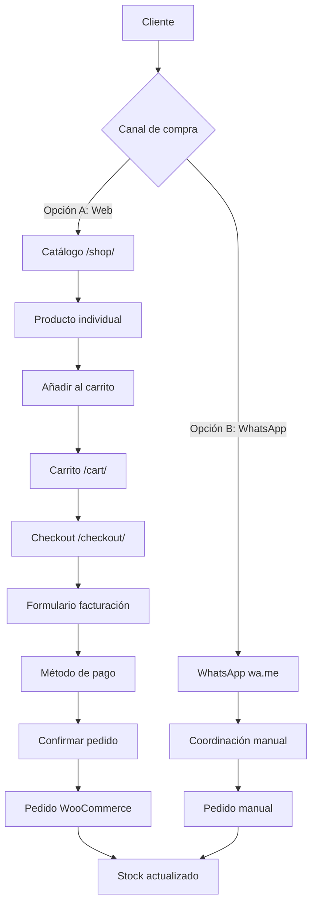
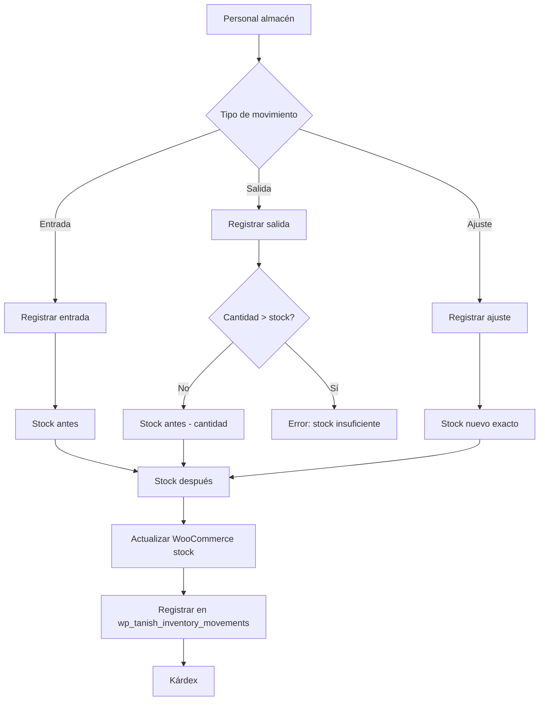
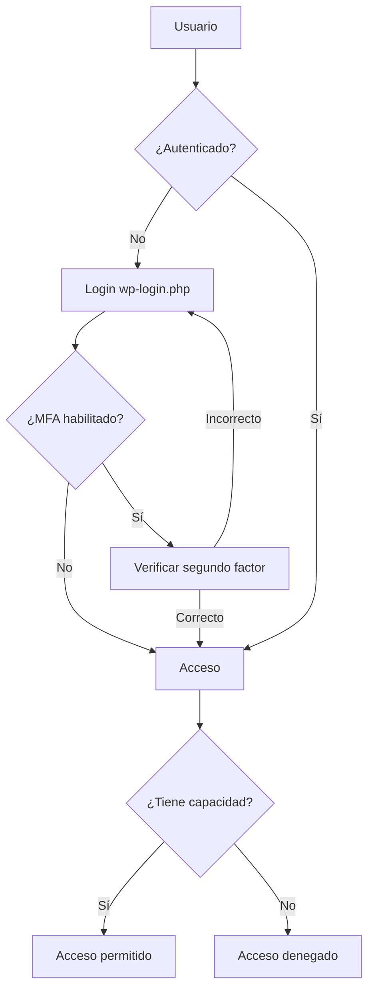

# 5.8 Flujograma — TANISH E-Commerce

## Flujo Principal: Comercio B2C

```mermaid
flowchart TD
    A[Cliente] --> B{Canal de compra}
    
    B -->|Opción A: Web| C[Catálogo /shop/]
    B -->|Opción B: WhatsApp| D[WhatsApp wa.me]
    
    C --> E[Producto individual]
    E --> F[Añadir al carrito]
    F --> G[Carrito /cart/]
    G --> H[Checkout /checkout/]
    H --> I[Formulario facturación]
    I --> J[Método de pago]
    J --> K[Confirmar pedido]
    K --> L[Pedido WooCommerce]
    L --> M[Stock actualizado]
    
    D --> N[Coordinación manual]
    N --> O[Pedido manual]
    O --> M
```

## Flujo: Inventario

```mermaid
flowchart TD
    A[Personal almacén] --> B{Tipo de movimiento}
    
    B -->|Entrada| C[Registrar entrada]
    B -->|Salida| D[Registrar salida]
    B -->|Ajuste| E[Registrar ajuste]
    
    C --> F[Stock antes]
    D --> G{Cantidad > stock?}
    E --> H[Stock nuevo exacto]
    
    G -->|No| I[Stock antes - cantidad]
    G -->|Sí| J[Error: stock insuficiente]
    
    F --> K[Stock después]
    I --> K
    H --> K
    
    K --> L[Actualizar WooCommerce stock]
    L --> M[Registrar en wp_tanish_inventory_movements]
    M --> N[Kárdex]
```

## Flujo: Seguridad

```mermaid
flowchart TD
    A[Usuario] --> B{¿Autenticado?}
    B -->|No| C[Login wp-login.php]
    C --> D{¿MFA habilitado?}
    D -->|Sí| E[Verificar segundo factor]
    D -->|No| F[Acceso]
    E -->|Correcto| F
    E -->|Incorrecto| C
    B -->|Sí| F
    F --> G{¿Tiene capacidad?}
    G -->|Sí| H[Acceso permitido]
    G -->|No| I[Acceso denegado]
```
